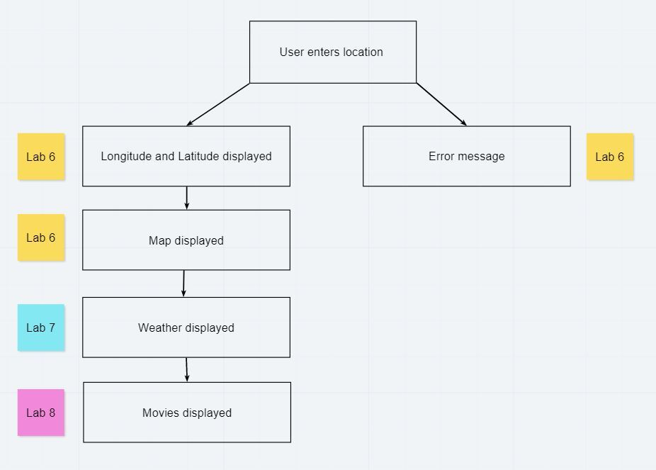

# City Explorer

**Author**: Cullen Sharp
**Version**: 1.0.0

## Overview

An app that displays information about a city and its location when the user searches for a city by name.

## Getting Started

Clone the repo, npm install, npm start

## Architecture

Axios, React, Node.js, Bootstrap

## Change Log

04-19-2021 13:57 - Scaffold out the app.

## Credit and Collaborations

Thank you to JB Tellez, Tim Egorov, and Hunter Britten.

---

## Time Estimates

Name of feature: Locations

Estimate of time needed to complete: 1hr

Start time: 14:30

Finish time:

Actual time needed to complete:
